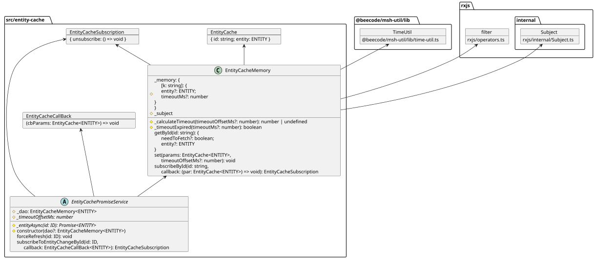

# msh-entity

> ⚠️ **DEPRECATED** — This package is no longer maintained and will not receive further updates. For frontend data fetching and caching, use [React Query](https://tanstack.com/query) (TanStack Query) instead.

Micro-service helper: entity cache

This project is intended to be used in typescript project.

<!-- toc -->

- [Install](#install)
- [Overview](#overview)
- [Why Deprecated?](#why-deprecated)
- [Diagram](#diagram)

<!-- tocstop -->

## Install

`npm i @beecode/msh-entity`

## Overview

A small, generic in-memory cache for entities (users, products, orders — any business object).

**What it does:**

- **`EntityCacheMemory`** — stores entities by ID in a plain JS object, with optional time-to-live (TTL) so entries auto-expire
- **`EntityCachePromiseService`** — abstract base class that ties the cache to an async data source; you implement one method (`_entityAsync`) to fetch the real data, and it handles caching, stale checks, and subscriber notifications automatically
- **RxJS subscriptions** — subscribe to entity changes and get notified when cached data updates

**Best fit:**

- Vanilla JS apps or CLI tools that need a lightweight cache
- Backend single-process services needing simple in-process caching without Redis
- Non-React frontends where a full data-fetching library is overkill

**Not suited for:**

- Distributed / multi-instance backends (no shared state across processes)
- Long-lived persistence across restarts
- Frontend apps already using React Query, SWR, or similar

## Why Deprecated?

This library overlaps heavily with established frontend data-fetching libraries like [React Query](https://tanstack.com/query), which provide the same caching, stale-while-revalidate, and subscription features — plus background refetching, request deduplication, retry logic, devtools, SSR support, pagination, and more.

If you're using React Query (or similar), this library adds no value and would mean two competing caches over the same data. For backend distributed caching, use Redis or a dedicated cache layer instead.

## Diagram

